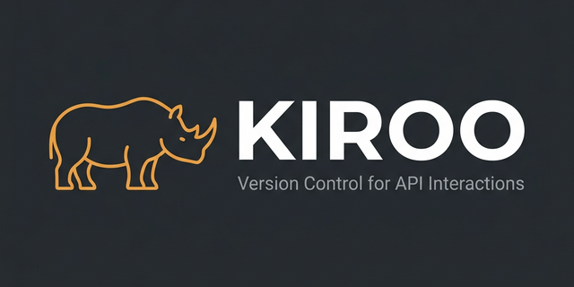

<div align="center">
  

  # 🦏 KIROO
  ### **Version Control for API Interactions**
  
  [](https://opensource.org/licenses/MIT)
  [](https://nodejs.org/)
  [](http://makeapullrequest.com)

  **Record, Replay, Snapshot, and Diff your APIs just like Git handles code.**

  [Installation](#-installation) • [Quick Start](#-quick-start) • [Key Features](#-core-capabilities) • [Why Kiroo?](#-why-kiroo)

</div>

---

## 📖 What is Kiroo?

Kiroo is **Version Control for API Interactions**. It treats your requests and responses as first-class, versionable artifacts that live right alongside your code in your Git repository.

Stop copy-pasting JSON into Postman. Stop losing your API history. Start versioning it. 🚀

---

## 🕸️ Visual Dependency Graph (`kiroo graph`)

Kiroo doesn't just record requests; it understands the **relationships** between them. 
- **Auto-Tracking**: Kiroo tracks variables created via `--save` and consumed via `{{key}}`.
- **Insight**: Instantly see how data flows from your `/login` to your `/profile` and beyond.

---

## 📊 Insights & Performance Dashboard (`kiroo stats`)

Monitor your API's health directly from your terminal.
- **Success Rates**: Real-time 2xx/4xx/5xx distribution.
- **Performance**: Average response times across all interactions.
- **Bottlenecks**: Automatically identifies your top 5 slowest endpoints.

---

## 🔌 Instant cURL Import (`kiroo import`)

Coming from a browser? Don't type a single header.
- **Copy-Paste Magic**: Just `Copy as cURL` from Chrome/Firefox and run `kiroo import`.
- **Clean Parsing**: Automatically handles multi-line commands, quotes, and complex flags.

---

## ✨ Features that WOW

### 🟢 **Git-Native Testing**
Capture a **Snapshot** of your entire API state and compare versions to detect breaking changes instantly.
```bash
kiroo snapshot save v1-stable
# ... make changes ...
kiroo snapshot compare v1-stable current
```

### 🌍 **Variable Chaining**
Chain requests like a pro. Save a token from one response and inject it into the next.
```bash
kiroo post /login --save jwt=data.token
kiroo get /users -H "Authorization: Bearer {{jwt}}"
```

### ⌨️ **Shorthand JSON Parser**
Forget escaping quotes. Type JSON like a human.
```bash
kiroo post /api/user -d "name=Yash email=yash@kiroo.io role=admin"
```

---

## 🚀 Quick Start

### 1. Installation
```bash
npm install -g kiroo
```

### 2. Initialization
```bash
kiroo init
```

### 3. Record Your First Request
```bash
kiroo get https://api.github.com/users/yash-pouranik
```

---

## 📚 Full Command Documentation

### `kiroo init`
Initialize Kiroo in your current project.
- **Description**: Creates the `.kiroo/` directory structure and a default `env.json`.
- **Prerequisites**: None. Run once per project.
- **Example**:
  ```bash
  kiroo init
  ```

### `kiroo get/post/put/delete <url>`
Execute and record an API interaction.
- **Description**: Performs an HTTP request, displays the response, and saves it to history.
- **Prerequisites**: Access to the URL (or a `baseUrl` set in the environment).
- **Arguments**:
  - `url`: The endpoint (Absolute URL or relative path if `baseUrl` exists).
- **Options**:
  - `-H, --header <key:value>`: Add custom headers.
  - `-d, --data <data>`: Request body (JSON or shorthand `key=val`).
  - `-s, --save <key=path>`: Save response data to environment variables.
- **Example**:
  ```bash
  kiroo post /api/auth/login -d "email=user@test.com password=123" --save token=data.token
  ```

### `kiroo list`
View your interaction history.
- **Description**: Displays a paginated list of all recorded requests.
- **Arguments**: None.
- **Options**:
  - `-n, --limit <number>`: How many records to show (Default: 10).
  - `-o, --offset <number>`: How many records to skip (Default: 0).
- **Example**:
  ```bash
  kiroo list -n 20
  ```

### `kiroo replay <id>`
Re-run a specific interaction.
- **Description**: Fetches the original request from history and executes it again.
- **Arguments**:
  - `id`: The timestamp ID of the interaction (found via `kiroo list`).
- **Example**:
  ```bash
  kiroo replay 2026-03-10T14-30-05-123Z
  ```

### `kiroo graph`
Visualize API dependencies.
- **Description**: Generates a tree view showing how data flows between endpoints via saved/used variables.
- **Prerequisites**: Recorded interactions that use `--save` and `{{variable}}`.
- **Example**:
  ```bash
  kiroo graph
  ```

### `kiroo stats`
Analytics dashboard.
- **Description**: Shows performance metrics, success rates, and identify slow endpoints.
- **Example**:
  ```bash
  kiroo stats
  ```

### `kiroo import`
Import from cURL.
- **Description**: Converts a cURL command into a Kiroo interaction. Opens an interactive editor if no argument is provided.
- **Arguments**:
  - `curl`: (Optional) The raw cURL string in quotes.
- **Example**:
  ```bash
  kiroo import "curl https://api.exa.com -H 'Auth: 123'"
  ```

### `kiroo snapshot` 
Snapshot management.
- **Commands**:
  - `save <tag>`: Save current history as a versioned state.
  - `list`: List all saved snapshots.
  - `compare <tag1> <tag2>`: Detect breaking changes between two states.
- **Example**:
  ```bash
  kiroo snapshot compare v1.stable current
  ```

### `kiroo env`
Environment & Variable management.
- **Commands**:
  - `list`: View all environments and their variables.
  - `use <name>`: Switch active environment (e.g., `prod`, `local`).
  - `set <key> <value>`: Set a variable in the active environment.
  - `rm <key>`: Remove a variable.
- **Example**:
  ```bash
  kiroo env set baseUrl https://api.myapp.com
  ```

### `kiroo clear`
Wipe history.
- **Description**: Deletes all recorded interactions to start fresh.
- **Options**:
  - `-f, --force`: Clear without a confirmation prompt.
- **Example**:
  ```bash
  kiroo clear --force
  ```

---

## 🤝 Contributing

Kiroo is an open-source project and we love contributions! Check out our [Contribution Guidelines](CONTRIBUTING.md).

---

## 📜 License

Distributed under the MIT License. See `LICENSE` for more information.

---

<div align="center">
  Built with ❤️ for Developers by <a href="https://github.com/yash-pouranik">Yash Pouranik</a>
</div>
