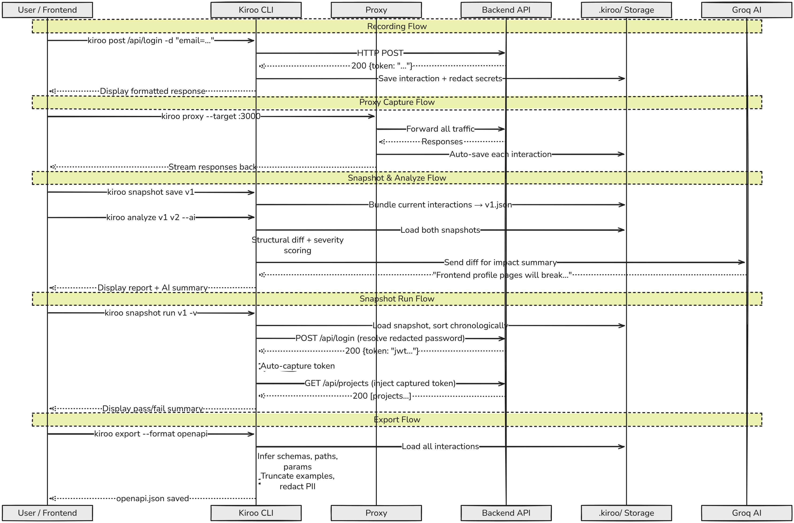

<div align="center">
  

  # 🦏 KIROO
  ### **Version Control for API Interactions**
  
  [](https://opensource.org/licenses/MIT)
  [](https://nodejs.org/)
  [](http://makeapullrequest.com)

  **Record, Replay, Snapshot, Analyze, and Export your APIs — like Git for HTTP workflows.**

  [Demo](#-demo) • [Feature Grid](#-feature-grid) • [Use Cases](#-real-world-use-cases) • [Install](#-installation) • [Docs](#-full-command-documentation) • [Judge Demo Guide](./DEMO.md)

</div>

---

## 📖 What is Kiroo?

Kiroo is **version control for API interactions**. It records real HTTP traffic, stores it locally in your repo, lets you replay history, compare snapshots, run semantic drift analysis, and export machine-readable artifacts like OpenAPI.

If your API changes frequently, Kiroo answers:
- What changed?
- What broke?
- Which consumers are impacted?

---

## 🎬 Demo

<div align="center">
  
</div>

- Quick judge flow: [`DEMO.md`](./DEMO.md)

---

## 🌐 Product Landing Page

- Landing page: [`docs/index.html`](./docs/index.html)
- Documentation page: [`docs/docs.html`](./docs/docs.html)
- Judge quick-test example (SDK + CLI): [`examples/judge-sdk-cli`](./examples/judge-sdk-cli)

---

## ✨ Feature Grid

| Capability | What it gives you |
|---|---|
| **Request Recording** | Store request/response history in `.kiroo/` for replay and auditability |
| **Snapshot Versioning** | Save versioned API states and compare contract drift |
| **AI Blast Radius Analysis** | Get severity scoring and impact summaries before deployment |
| **Time-Travel Proxy** | Auto-capture frontend traffic without manually typing requests |
| **Zero-Code API Checks** | CI-friendly assertions for status, fields, and exact matches |
| **Load Benchmarking** | Concurrency and throughput testing from CLI |
| **OpenAPI/Postman Export** | Generate shareable artifacts from observed traffic |
| **Secret Redaction** | Mask sensitive data so interaction files stay Git-safe |
| **Dependency Graph + Stats** | Understand variable flow and performance bottlenecks |

---

## 🎯 Real-World Use Cases

- **Pre-release contract safety:** Compare `v1` vs `v2` snapshots and fail CI on high-severity changes.
- **Frontend debugging:** Capture browser flows with `kiroo proxy` and replay problematic requests instantly.
- **Regression protection:** Convert critical endpoints into `kiroo check` assertions.
- **API docs bootstrap:** Export real-world interactions as OpenAPI for partner teams.
- **Performance guardrails:** Benchmark hot endpoints after backend changes.

---

## 🚀 Installation

### 1) Install globally
```bash
npm install -g kiroo
```

### 2) Initialize in your repo
```bash
kiroo init
```

### 3) Run a first request
```bash
kiroo get https://api.github.com/users/yash-pouranik
```

### 4) Snapshot + analyze
```bash
kiroo snapshot save v1
kiroo snapshot compare v1 current --analyze
```

---

## 📚 Full Command Documentation

### `kiroo init`
Initialize Kiroo in your current project.
- **Description**: Creates the `.kiroo/` directory structure, a default `env.json`, and `.kiroo/config.json` with deterministic/redaction-safe defaults. During setup, you can store `baseUrl`, `GROQ_API_KEY`, and `LINGODOTDEV_API_KEY` into `.kiroo/env.json`.
- **Prerequisites**: None. Run once per project.
- **Example**:
  ```bash
  kiroo init
  ```

### `kiroo get/post/put/delete/patch <url>`
Execute and record an API interaction.
- **Description**: Performs an HTTP request, displays the response, and saves it to history.
- **Prerequisites**: Access to the URL (or a `baseUrl` set in the environment).
- **Arguments**:
  - `url`: The endpoint (Absolute URL or relative path if `baseUrl` exists).
- **Options**:
  - `-H, --header <key:value>`: Add custom headers.
  - `-d, --data <data>`: Request body (JSON or shorthand `key=val`).
  - `-s, --save <key=path>`: Save response data to environment variables.
- **Example**:
  ```bash
  kiroo post /api/auth/login -d "email=user@test.com password=123" --save token=data.token
  kiroo patch /api/profile -d "name=UpdatedName"
  ```

### `kiroo list`
View your interaction history.
- **Description**: Displays a paginated list of all recorded requests.
- **Arguments**: None.
- **Options**:
  - `-n, --limit <number>`: How many records to show (Default: 10).
  - `-o, --offset <number>`: How many records to skip (Default: 0).
- **Example**:
  ```bash
  kiroo list -n 20
  ```

### `kiroo replay <id>`
Re-run a specific interaction.
- **Description**: Fetches the original request from history and executes it again.
- **Arguments**:
  - `id`: The timestamp ID of the interaction (found via `kiroo list`).
- **Example**:
  ```bash
  kiroo replay 2026-03-10T14-30-05-123Z
  ```

### `kiroo edit <id>`
Quick Refinement. Edit an interaction on the fly and replay it.
- **Description**: Opens the stored interaction JSON in your default system editor (VS Code, Nano, Vim, etc.). Edit the headers, body, or URL, save, and close. Kiroo immediately replays the updated request.
- **Arguments**:
  - `id`: The timestamp ID of the interaction.
- **Example**:
  ```bash
  kiroo edit 2026-03-10T14-30-05-123Z
  ```

### `kiroo proxy`
Start a time-travel proxy.
- **Description**: Acts as a middleware between the frontend and backend, automatically capturing HTTP traffic and saving it as interactions without typing CLI commands.
- **Options**:
  - `-t, --target <url>`: Target URL of the backend.
  - `-p, --port <port>`: Port for the proxy to listen on (Default: 8080).
- **Example**:
  ```bash
  kiroo proxy --target http://localhost:3000 --port 8080
  ```

### `kiroo check <url>`
Zero-Code Testing engine.
- **Description**: Executes a request and runs assertions on the response. Exits with code 1 on failure.
- **Prerequisites**: Access to the URL.
- **Arguments**:
  - `url`: The endpoint.
- **Options**:
  - `-m, --method <method>`: HTTP method (GET, POST, etc. Default: GET).
  - `-H, --header <key:value>`: Add custom headers.
  - `-d, --data <data>`: Request body.
  - `--status <numbers>`: Expected HTTP status code.
  - `--has <fields>`: Comma-separated list of expected fields in JSON.
  - `--match <key=val>`: Exact value matching for JSON fields.
- **Example**:
  ```bash
  # Check if login is successful
  kiroo check /api/login -m POST -d "user=yash pass=123" --status 200 --has token
  ```

### `kiroo bench <url>`
Local load testing and benchmarking.
- **Description**: Sends multiple concurrent HTTP requests to measure endpoint performance (Latency, RPS, Error Rate).
- **Prerequisites**: Access to the URL.
- **Arguments**:
  - `url`: The endpoint (supports Auto-BaseURL).
- **Options**:
  - `-m, --method <method>`: HTTP method (GET, POST, etc. Default: GET).
  - `-n, --number <number>`: Total requests to send (Default: 10).
  - `-c, --concurrent <number>`: Concurrent workers (Default: 1).
  - `-v, --verbose`: Show the HTTP status, response time, and truncated response body for every individual request instead of a single progress spinner.
  - `-H, --header <key:value>`: Add custom headers.
  - `-d, --data <data>`: Request body.
- **Example**:
  ```bash
  # Send 100 requests in batches of 10
  kiroo bench /api/projects -n 100 -c 10
  ```

### `kiroo graph`
Visualize API dependencies.
- **Description**: Generates a tree view showing how data flows between endpoints via saved/used variables.
- **Prerequisites**: Recorded interactions that use `--save` and `{{variable}}`.
- **Example**:
  ```bash
  kiroo graph
  ```

### `kiroo stats`
Analytics dashboard.
- **Description**: Shows performance metrics, success rates, and identify slow endpoints.
- **Example**:
  ```bash
  kiroo stats
  ```

### `kiroo import`
Import from cURL.
- **Description**: Converts a cURL command into a Kiroo interaction. Opens an interactive editor if no argument is provided.
- **Arguments**:
  - `curl`: (Optional) The raw cURL string in quotes.
- **Example**:
  ```bash
  kiroo import "curl https://api.exa.com -H 'Auth: 123'"
  ```

### `kiroo snapshot` 
Snapshot management.
- **Commands**:
  - `save <tag>`: Save current history as a versioned state.
  - `list`: List all saved snapshots.
  - `compare <tag1> <tag2>`: Detect structural changes between two states.
  - `compare <tag1> <tag2> --analyze`: Structural compare + semantic severity in one run.
  - `run <tag>`: Execute all interactions in a snapshot sequentially (supports auth token chaining).
- **Options for `run`**:
  - `-v, --verbose`: Show response preview for each request.
  - `--fail-fast`: Stop immediately on first failed interaction.
  - `--timeout <ms>`: Request timeout in milliseconds (Default: 30000).
- **Example**:
  ```bash
  kiroo snapshot compare v1.stable current
  kiroo snapshot run v1.stable --fail-fast
  ```

### `kiroo analyze <tag1> <tag2>`
Semantic blast-radius analysis between snapshots.
- **Description**: Generates endpoint-wise severity report for contract drift (`low|medium|high|critical`) and can optionally generate AI impact summary via Groq.
- **Options**:
  - `--json`: Output machine-readable JSON report.
  - `--fail-on <severity>`: Exit non-zero if max severity meets threshold.
  - `--ai`: Add Groq-powered impact summary.
  - `--model <model>`: Override default model priority.
  - `--max-tokens <number>`: Max completion tokens for AI summary.
- **Environment**:
  - `GROQ_API_KEY` in `.kiroo/env.json`: Required when `--ai` is used.
- **Example**:
  ```bash
  kiroo analyze before-refactor after-refactor --fail-on high
  kiroo analyze before-refactor after-refactor --ai --model qwen/qwen3-32b
  kiroo snapshot compare before-refactor after-refactor --analyze --ai
  ```

### `kiroo export`
Team Compatibility. Export to Postman or OpenAPI.
- **Description**: Converts stored Kiroo interactions into Postman Collection or OpenAPI/Swagger JSON for team sharing and docs.
- **Options**:
  - `-f, --format <format>`: `postman` or `openapi` (Default: `postman`).
  - `-o, --out <filename>`: Output file name (Default: `kiroo-collection.json` for postman, `openapi.json` for openapi).
  - `--title <title>`: OpenAPI title override.
  - `--api-version <version>`: OpenAPI version override.
  - `--server <url>`: OpenAPI server URL override.
  - `--path-prefix <prefix>`: Include only matching API paths (e.g. `/api`).
  - `--min-samples <number>`: Include only operations observed at least N times.
- **Example**:
  ```bash
  kiroo export --format postman --out my_api_collection.json
  kiroo export --format openapi --out openapi.json --title "My API" --api-version 1.0.0
  kiroo export --format openapi --path-prefix /api --min-samples 2 --out openapi.json
  ```

### `kiroo scrub`
Redact sensitive values in already stored data.
- **Description**: Scans `.kiroo/interactions` and `.kiroo/snapshots`, then masks secrets like auth headers, cookies, tokens, passwords, and API keys.
- **Options**:
  - `--dry-run`: Show what would change without modifying files.
- **Example**:
  ```bash
  kiroo scrub --dry-run
  kiroo scrub
  ```

### `kiroo env`
Environment & Variable management.
- **Commands**:
  - `list`: View all environments and their variables.
  - `use <name>`: Switch active environment (e.g., `prod`, `local`).
  - `set <key> <value>`: Set a variable in the active environment.
  - `rm <key>`: Remove a variable.
- **Note**:
  - Sensitive keys (tokens/passwords/API keys) are masked in `kiroo env list`.
- **Example**:
  ```bash
  kiroo env set baseUrl https://api.myapp.com
  kiroo env set GROQ_API_KEY your_key
  kiroo env set LINGODOTDEV_API_KEY your_key
  ```

### `kiroo clear`
Wipe history.
- **Description**: Deletes all recorded interactions to start fresh.
- **Options**:
  - `-f, --force`: Clear without a confirmation prompt.
- **Example**:
  ```bash
  kiroo clear --force
  ```

### `kiroo help [command]`
Get command-level help directly in CLI.
- **Description**: Shows global help or detailed help for a specific command.
- **Arguments**:
  - `command`: (Optional) Command name to inspect.
- **Example**:
  ```bash
  kiroo help
  kiroo help bench
  ```

---

## 🤝 Contributing

Kiroo is an open-source project and we love contributions! Check out our [Contribution Guidelines](CONTRIBUTING.md).

---

## 📜 License

Distributed under the MIT License. See `LICENSE` for more information.

---

<div align="center">
  Built with ❤️ for Developers
</div>
